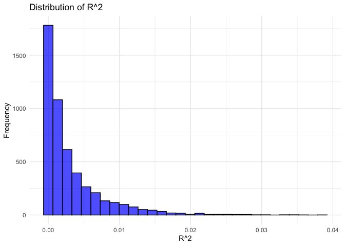
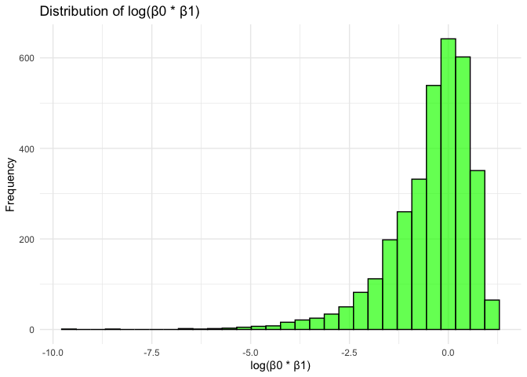
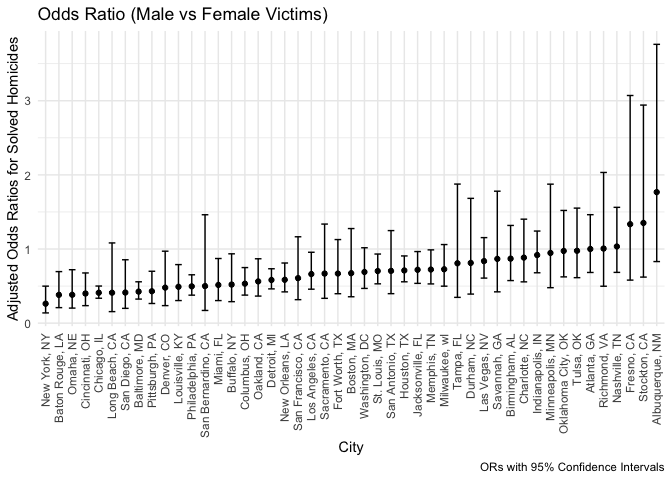
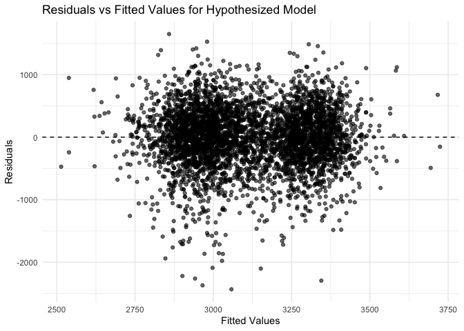
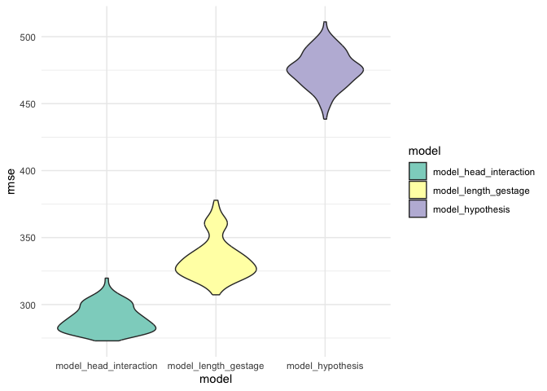

p8105_hw6_rkk2139
================
Riya Kalra
2024-11-28

### Problem 1

``` r
library(tidyverse)
```

    ## ── Attaching core tidyverse packages ──────────────────────── tidyverse 2.0.0 ──
    ## ✔ dplyr     1.1.4     ✔ readr     2.1.5
    ## ✔ forcats   1.0.0     ✔ stringr   1.5.1
    ## ✔ ggplot2   3.5.1     ✔ tibble    3.2.1
    ## ✔ lubridate 1.9.3     ✔ tidyr     1.3.1
    ## ✔ purrr     1.0.2     
    ## ── Conflicts ────────────────────────────────────────── tidyverse_conflicts() ──
    ## ✖ dplyr::filter() masks stats::filter()
    ## ✖ dplyr::lag()    masks stats::lag()
    ## ℹ Use the conflicted package (<http://conflicted.r-lib.org/>) to force all conflicts to become errors

``` r
library(dplyr)
library(ggplot2)
library(broom)
library(purrr)
library(modelr)
```

    ## 
    ## Attaching package: 'modelr'
    ## 
    ## The following object is masked from 'package:broom':
    ## 
    ##     bootstrap

``` r
library(tidyr)
library(crossval)


weather_df = 
  rnoaa::meteo_pull_monitors(
    c("USW00094728"),
    var = c("PRCP", "TMIN", "TMAX"), 
    date_min = "2017-01-01",
    date_max = "2017-12-31") |>
  mutate(
    name = recode(id, USW00094728 = "CentralPark_NY"),
    tmin = tmin / 10,
    tmax = tmax / 10) |>
  select(name, id, everything())
```

    ## using cached file: /Users/riyakalra/Library/Caches/org.R-project.R/R/rnoaa/noaa_ghcnd/USW00094728.dly
    ## date created (size, mb): 2024-11-28 16:55:38.137298 (8.667)
    ## file min/max dates: 1869-01-01 / 2024-11-30

``` r
# Simulate the 2017 Central Park weather data structure
set.seed(42)
n_samples <- 365
weather_df <- data.frame(
  tmin = runif(n_samples, -10, 20),
  tmax = runif(n_samples, 5, 35)
)

# Placeholder for bootstrap results
r2_values <- c()
log_beta_product_values <- c()

# Number of bootstrap samples
n_bootstrap <- 5000

# Perform bootstrap sampling
for (i in 1:n_bootstrap) {
  # Bootstrap resample
  sample <- weather_df |> sample_frac(replace = TRUE)
  
  # Fit linear regression
  fit <- lm(tmax ~ tmin, data = sample)
  
  # Calculate R^2
  r2 <- glance(fit)$r.squared
  r2_values <- c(r2_values, r2)
  
  # Extract coefficients
  beta0 <- coef(fit)[1]
  beta1 <- coef(fit)[2]
  
  # Compute log(beta0 * beta1), avoiding log of non-positive values
  if (beta0 * beta1 > 0) {
    log_beta_product <- log(beta0 * beta1)
    log_beta_product_values <- c(log_beta_product_values, log_beta_product)
  }
}

# Calculate 95% confidence intervals
r2_ci <- quantile(r2_values, c(0.025, 0.975))
log_beta_product_ci <- quantile(log_beta_product_values, c(0.025, 0.975))

# Plot distributions
r2_plot <- ggplot(data.frame(r2_values), aes(x = r2_values)) +
  geom_histogram(bins = 30, fill = "blue", color = "black", alpha = 0.7) +
  labs(title = "Distribution of R^2", x = "R^2", y = "Frequency") +
  theme_minimal()

log_beta_plot <- ggplot(data.frame(log_beta_product_values), aes(x = log_beta_product_values)) +
  geom_histogram(bins = 30, fill = "green", color = "black", alpha = 0.7) +
  labs(title = "Distribution of log(β0 * β1)", x = "log(β0 * β1)", y = "Frequency") +
  theme_minimal()

print(paste("95% CI for R^2: [", r2_ci[1], ", ", r2_ci[2], "]", sep = ""))
```

    ## [1] "95% CI for R^2: [2.74755415576156e-06, 0.0155623949643023]"

``` r
print(paste("95% CI for log(β0 * β1): [", log_beta_product_ci[1], ", ", log_beta_product_ci[2], "]", sep = ""))
```

    ## [1] "95% CI for log(β0 * β1): [-3.24630686941392, 0.864991679102032]"

``` r
print(r2_plot)
```

<!-- -->

``` r
print(log_beta_plot)
```

<!-- -->

### Problem 2

``` r
# Read the data
homicides <- read_csv("data/homicide-data.csv")
```

    ## Rows: 52179 Columns: 12
    ## ── Column specification ────────────────────────────────────────────────────────
    ## Delimiter: ","
    ## chr (9): uid, victim_last, victim_first, victim_race, victim_age, victim_sex...
    ## dbl (3): reported_date, lat, lon
    ## 
    ## ℹ Use `spec()` to retrieve the full column specification for this data.
    ## ℹ Specify the column types or set `show_col_types = FALSE` to quiet this message.

``` r
# Clean and preprocess the data
homicides <- homicides |>
  # Create the city_state variable
  mutate(city_state = paste(city, state, sep = ", ")) |>
  # Remove specific cities
  filter(!city_state %in% c("Dallas, TX", "Phoenix, AZ", "Kansas City, MO", "Tulsa, AL")) |>
  # Filter for victim race (black or white only)
  filter(victim_race %in% c("White", "Black")) |>
  # Ensure victim_age is numeric
  mutate(victim_age = as.numeric(victim_age)) |>
  # Create the binary "solved" variable
  mutate(resolved = if_else(disposition == "Closed by arrest", 1, 0))
```

    ## Warning: There was 1 warning in `mutate()`.
    ## ℹ In argument: `victim_age = as.numeric(victim_age)`.
    ## Caused by warning:
    ## ! NAs introduced by coercion

``` r
# Filter for Baltimore, MD for the first analysis
baltimore <- homicides |>
  filter(city_state == "Baltimore, MD")

# Fit logistic regression for Baltimore
baltimore_glm <- glm(resolved ~ victim_age + victim_sex + victim_race, 
                     family = binomial(link = "logit"), 
                     data = baltimore)

# Use broom::tidy to extract the results
baltimore_results <- broom::tidy(baltimore_glm) |>
  filter(term == "victim_sexMale") |>
  mutate(OR = exp(estimate),
         lower_CI = exp(estimate - 1.96 * std.error),
         upper_CI = exp(estimate + 1.96 * std.error))

# Display adjusted OR and CI for Baltimore
print(baltimore_results)
```

    ## # A tibble: 1 × 8
    ##   term           estimate std.error statistic  p.value    OR lower_CI upper_CI
    ##   <chr>             <dbl>     <dbl>     <dbl>    <dbl> <dbl>    <dbl>    <dbl>
    ## 1 victim_sexMale   -0.854     0.138     -6.18 6.26e-10 0.426    0.325    0.558

``` r
# Run glm for all cities
results <- homicides |>
  group_by(city_state) |>
  nest() |>
  mutate(model = map(data, ~ glm(resolved ~ victim_age + victim_sex + victim_race, 
                                 family = binomial(link = "logit"), 
                                 data = .x)),
         tidy_model = map(model, broom::tidy)) |>
  unnest(tidy_model) |>
  filter(term == "victim_sexMale") |>
  mutate(OR = exp(estimate),
         lower_CI = exp(estimate - 1.96 * std.error),
         upper_CI = exp(estimate + 1.96 * std.error)) |>
  select(city_state, OR, lower_CI, upper_CI)

# Plot the results
results |>
  ungroup() |>
  arrange(OR) |> 
  mutate(city_state = factor(city_state, levels = city_state[order(OR)])) |>
  ggplot(aes(x = city_state, y = OR, ymin = lower_CI, ymax = upper_CI)) +
  geom_point() +
  geom_errorbar(aes(ymin = lower_CI, ymax = upper_CI), width = 0.5) +
  labs(title = "Odds Ratio (Male vs Female Victims)",
       x = "City",
       y = "Adjusted Odds Ratios for Solved Homicides",
       caption = "ORs with 95% Confidence Intervals") +
  theme_minimal() +
  theme(axis.text.x = element_text(angle = 90, hjust = 1, vjust = 0.5))
```

<!-- -->

The plot illustrates that, across the 47 cities, most adjusted odds
ratios (ORs) for solving homicides involving male versus female victims
are below 1. This suggests male victims are generally less likely to
have their cases solved compared to female victims. However, not all
cities show statistically significant differences. Confidence intervals
that include 1 indicate no clear evidence of a difference, meaning we
cannot draw definitive conclusions for those cities.

New York stands out with the lowest OR, implying the largest disparity
in solved cases between male and female victims, with male victims being
significantly less likely to have their homicides resolved. On the other
hand, Albuquerque has the highest OR, but its confidence interval
includes 1, so we cannot confirm a significant difference there.

Interestingly, cities with ORs closer to 1, regardless of confidence
interval size, suggest less disparity in solving cases for male and
female victims. The wide range of ORs and their confidence intervals
across cities also highlights substantial variability in how different
jurisdictions handle homicide investigations based on the victim’s
gender. This could reflect differences in resources, policies, or
societal factors influencing case resolutions.

Overall, while the data suggests a general trend of lower resolution
rates for male victims, the variability and overlapping confidence
intervals emphasize the need for caution when interpreting these results
city by city.

### Problem 3

To create a basis for my own model, I researched other studies that
looked at different factors influencing birth weight. This article from
PubMed: <https://pubmed.ncbi.nlm.nih.gov/7570074/> suggests that low
birth weight and low pre-pregnancy BMI can increase the risk of low
birthweight and decrease chance of survival. However, factors such as
gender can influence risk of mortality, with lighter, female babies,
being more likely to survive despite their lower birth weight. It
details that “maternal race, infant sex, plurality, altitude, education,
and smoking” are factors that affect the entire birthweight
distribution. Therefore I am choosing to use `babysex`: baby’s sex,
`mrace`: mother’s race, `ppbmi`: mother’s pre-pregnancy BMI, and
`smoken`: average number of cigarettes smoked per day during pregnancy.
.

``` r
# Read the dataset
 
birth_data <- read_csv("https://p8105.com/data/birthweight.csv")
```

    ## Rows: 4342 Columns: 20
    ## ── Column specification ────────────────────────────────────────────────────────
    ## Delimiter: ","
    ## dbl (20): babysex, bhead, blength, bwt, delwt, fincome, frace, gaweeks, malf...
    ## 
    ## ℹ Use `spec()` to retrieve the full column specification for this data.
    ## ℹ Specify the column types or set `show_col_types = FALSE` to quiet this message.

``` r
# Data cleaning
birth_data <- birth_data |>
  janitor::clean_names() |> 
  mutate(
    babysex = 
      case_match(babysex,
          1 ~ "male",
          2 ~ "female"),
    babysex = as.factor(babysex),
    malform = 
      case_match(malform,
          0 ~ "absent",
          1 ~ "present"),
    malform = as.factor(malform),
    frace =
      case_match(frace,
          1 ~ "white",
          2 ~ "black",
          3 ~ "asian",
          4 ~ "puerto rican",
          8 ~ "other"),
    frace = fct_infreq(frace),
    mrace = 
      case_match(mrace,
          1 ~ "white",
          2 ~ "black",
          3 ~ "asian",
          4 ~ "puerto rican",
          8 ~ "other"),
    mrace = fct_infreq(mrace))

# Fit a proposed regression model
model_hypothesis <- lm(
  bwt ~ babysex + mrace + ppbmi + smoken,
  data = birth_data
)

# Add residuals and predictions for diagnostic plotting
birth_data <- birth_data |>
  add_predictions(model_hypothesis) |>
  add_residuals(model_hypothesis)

# Plot residuals vs. fitted values
birth_data |>
  ggplot(aes(x = pred, y = resid)) +
  geom_point(alpha = 0.6) +
  geom_hline(yintercept = 0, linetype = "dashed") +
  labs(
    title = "Residuals vs Fitted Values for Hypothesized Model",
    x = "Fitted Values",
    y = "Residuals"
  ) +
  theme_minimal()
```

<!-- -->

``` r
# Compare model to other models

# model 1: using length at birth using length at birth and gestational age as predictors (main effects only)
model_length_gestage <- lm(bwt ~ blength + gaweeks, data = birth_data)
model_length_gestage |> 
  broom::tidy() |> 
  knitr::kable() 
```

| term        |    estimate | std.error | statistic | p.value |
|:------------|------------:|----------:|----------:|--------:|
| (Intercept) | -4347.66707 | 97.958360 | -44.38281 |       0 |
| blength     |   128.55569 |  1.989891 |  64.60439 |       0 |
| gaweeks     |    27.04673 |  1.717930 |  15.74379 |       0 |

``` r
# model 2: using head circumference, length, sex, and all interactions (including the three-way interaction)
model_head_interaction <- lm(
  bwt ~ bhead * blength * babysex,
  data = birth_data
)

model_head_interaction |> 
  broom::tidy() |> 
  knitr::kable() 
```

| term                      |     estimate |    std.error |  statistic |   p.value |
|:--------------------------|-------------:|-------------:|-----------:|----------:|
| (Intercept)               |  -801.948671 | 1102.3077046 | -0.7275180 | 0.4669480 |
| bhead                     |   -16.597546 |   34.0916082 | -0.4868514 | 0.6263883 |
| blength                   |   -21.645964 |   23.3720477 | -0.9261475 | 0.3544209 |
| babysexmale               | -6374.868351 | 1677.7669213 | -3.7996150 | 0.0001469 |
| bhead:blength             |     3.324444 |    0.7125586 |  4.6655020 | 0.0000032 |
| bhead:babysexmale         |   198.393181 |   51.0916850 |  3.8830816 | 0.0001047 |
| blength:babysexmale       |   123.772887 |   35.1185360 |  3.5244319 | 0.0004288 |
| bhead:blength:babysexmale |    -3.878053 |    1.0566296 | -3.6702106 | 0.0002453 |

``` r
# Cross-validated prediction error
cv_split = crossv_mc(birth_data, 100)

# Function to calculate RMSE for a given model (data = x, refers to training dataset)
cv_rmse =
  cv_split |> 
  mutate(
    model_hypothesis = map(train, \(x) lm(bwt ~ babysex + mrace + ppbmi + smoken , data = x)),
    model_length_gestage = map(train, \(x) lm(bwt ~ blength + gaweeks, data = x)),
    model_head_interaction = map(train, \(x) lm(bwt ~ bhead + blength + babysex + bhead*blength + bhead*babysex + blength*babysex + bhead*blength*babysex, data = x))
  ) |> 
  mutate(
    rmse_model_hypothesis = map2_dbl(model_hypothesis, test, rmse),
    rmse_model_length_gestage = map2_dbl(model_length_gestage, test, rmse),
    rmse_model_head_interaction = map2_dbl(model_head_interaction, test, rmse)
  )

# Compare distributions using violin and mean error
cv_rmse |> 
  summarize(
    mean_error_hyp = mean(rmse_model_hypothesis),
    mean_error_ln_gest = mean(rmse_model_length_gestage),
    mean_error_head_inter = mean(rmse_model_head_interaction)
  ) |> 
  knitr::kable()
```

| mean_error_hyp | mean_error_ln_gest | mean_error_head_inter |
|---------------:|-------------------:|----------------------:|
|       475.6563 |           334.1528 |              289.4489 |

``` r
cv_rmse |> 
  select(starts_with("rmse")) |> 
  pivot_longer(
    everything(),
    names_to = "model", 
    values_to = "rmse",
    names_prefix = "rmse_"
  ) |> 
  mutate(model = fct_reorder(model, rmse, .fun = median)) |>
  ggplot(aes(x = model, y = rmse, fill = model)) + 
  geom_violin() +
  scale_fill_brewer(palette = "Set3") +
  theme_minimal()
```

<!-- -->

We can see that the mean error of my hypothesis model is the highest,
and the error of the third model, which accounts for the three-way
interactions, is the lowest. This is represented visually by the violin
plot, where the hypothesized model is the highest and the third model is
the lowest. This indicates that accounting for those interactions
increased predictive accuracy, and that my model did not successfully
account for these factors as well as that model.
